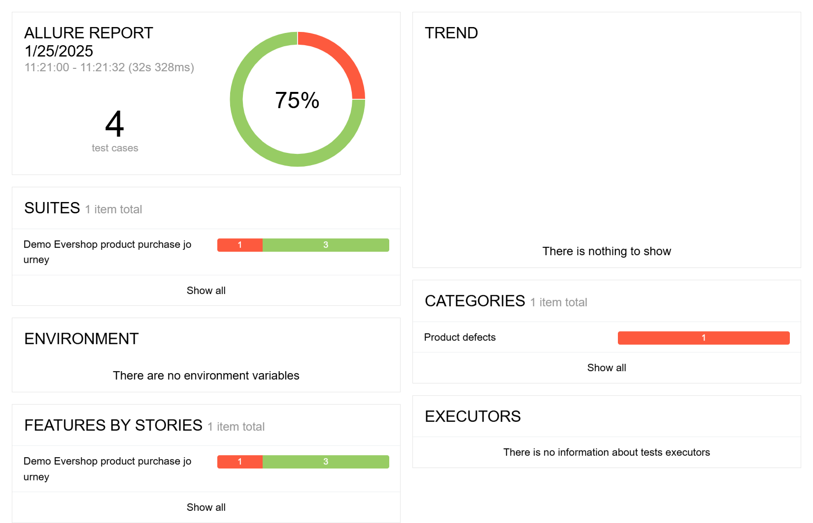

# Demo Evershop Product Purchase Journey Automation Test

This repository contains an automated test script for verifying the product purchase journey on the Demo Evershop application. The script is written using JavaScript, WebdriverIO for browser automation, and Chai for assertions. The Allure reporting framework is integrated to generate detailed test reports.

---

## Project Structure

```
|-- pages
|   |-- home
|       |-- homeActions.js
|   |-- productDetails
|       |-- productDetailsActions.js
|   |-- cart
|       |-- cartActions.js
|-- tests
|   |-- evershopProductPurchaseJourney.test.js
|-- reports
|   |-- allure-results
|-- README.md
```

- **pages**: Contains reusable action modules for different pages (e.g., Home, Product Details, Cart).
- **tests**: Contains test scripts for various scenarios.
- **reports**: Stores Allure test results.
- **README.md**: Documentation for the project.

---

## Pre-requisites

Ensure you have the following installed:

- Node.js
- npm (comes with Node.js)
- Allure report

---

## Setup Instructions

1. Clone the repository:
   ```bash
   git clone <repository-url>
   cd <repository-directory>
   ```

2. Install dependencies:
   ```bash
   npm install
   ```

3. Install Allure CLI (if not already installed):
   ```bash
   npm install -g allure-commandline --save-dev
   ```

---

## Running Tests

Execute the following command to run the test script:
```bash
npm run wdio
```

---

## Generating Allure Report

1. Run the tests and generate the Allure results:
   ```bash
   npm run wdio
   ```

2. Generate and open the Allure report:
   ```bash
   allure generate ./reports/allure-results --clean && allure open
   ```

The report will open in your default browser and provide detailed insights into the test execution.

---

## Test Scenarios Covered

1. **Search with a Valid Product**
   - Searches for a product and ensures the results are displayed correctly.

2. **Add Product to Cart**
   - Selects a product, customizes options (size, color, quantity), and adds it to the cart.

3. **Verify Product Name in Cart Page**
   - Confirms that the product added to the cart matches the selected product.

4. **Verify Grand Total Price in Cart Page**
   - Validates that the calculated grand total price in the cart matches the expected value.

---

## Customization

You can customize test data (e.g., product name, size, color, quantity) by modifying the variables in the test script:

```javascript
const searchedText = "Nike react phantom";
const productColor = "Black";
const productSize = "X";
const qty = "2";
```
## Report Preview

### Summary


.png)


